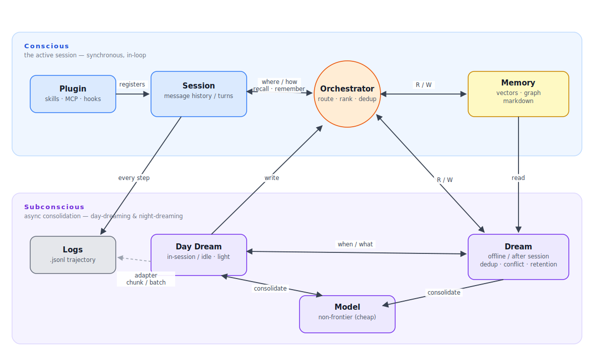

# Architecture — Cookbook Memory

> **Technical contract** (the *how & where*). This is the human-readable mirror of
> the frozen `eval/memeval/schema.py` + `protocols.py`. It is the doc that prevents
> **interface drift** — the conflict type tests can't catch. Change only via a
> `[CONTRACT]` PR (see [`plan.md`](plan.md)).

## 1. Components
A coding agent writes memories as it works; a **router** sends each query to the
one backend that answers best; an **offline "dreaming" worker** keeps the store
clean. Four modules over three indexed storage backends. See the diagram on the
site: [`assets/img/architecture.svg`](assets/img/architecture.svg).

1. **Persistence layer (write)** — what/when/where to save; tags each item.
2. **Intelligent router (dispatch)** — classify query → single best backend.
3. **Retrieval orchestrator (read)** — rank by `recency × relevancy`, dedup, return.
4. **Dreaming component (async)** — dedup, conflict resolution, governance, retention.

The **OpenCode memory framework** (`eval/memeval/opencode/`, Keith) is the agent
that consumes all four: it wraps OpenCode's loop as an `AgentAdapter` and exposes
a single `MemoryFramework` (itself a `MemoryStore`) that **routes reads/writes to
Brent's backends and runs Scott's dreaming**. The eval-side seam it plugs into —
`AgentAdapter` + `run_agent` — lives in `eval/memeval/agent.py` (Ken).

### System diagram — Conscious / Subconscious

The team whiteboard view: a **Conscious** band (the live, in-loop session —
synchronous) over a **Subconscious** band (async consolidation — day-dreaming and
night-dreaming), with the **plugin** as the only surface the coding harness sees.
From Keith's plugin-MVP plan ([PR #2](https://github.com/kenhuangus/agent-memory-harness/pull/2),
[`docs/harnesses/04-system-diagram.md`](docs/harnesses/04-system-diagram.md)).



The two bands are the core idea: the **Conscious** top row is the live path
(Plugin → Session → Orchestrator ↔ Memory); the **Subconscious** bottom row is the
offline path (Logs · Day Dream · Model · Dream). Arrows cross the async boundary
between them.

```mermaid
flowchart LR
  %% ===== TOP ROW — live path (left to right) =====
  Plugin["Plugin<br>skills · MCP · hooks"]
  Session["Session<br>message history"]
  Orch(("Orchestrator<br>route · rank · dedup"))
  Mem["Memory<br>vectors · graph · markdown"]

  Plugin --> Session
  Session <-->|where / how| Orch
  Orch <-->|R / W| Mem

  %% ===== BOTTOM ROW — offline / subconscious =====
  Logs["Logs<br>.jsonl"]
  DayDream["Day Dream<br>in-session / idle"]
  Model["Model<br>not frontier"]
  Dream["Dream<br>offline / after session"]

  %% vertical drops from top row to bottom row
  Session --> Logs
  DayDream -->|write| Orch
  Orch <-->|R / W| Dream
  Mem -->|read| Dream

  %% bottom-row wiring
  DayDream -.->|adapter · chunk / batch| Logs
  DayDream <-->|when / what| Dream
  DayDream <--> Model
  Dream --> Model

  %% pin the two rows (invisible alignment edges)
  Logs ~~~ DayDream ~~~ Model ~~~ Dream

  %% ===== styling =====
  classDef harness fill:#eaf2ff,stroke:#3b6fb0,color:#10243e;
  classDef core fill:#fff1df,stroke:#c97a1a,color:#3e2710;
  classDef store fill:#fff8e0,stroke:#b08900,color:#3e3410;
  classDef sub fill:#efe8ff,stroke:#7a52c0,color:#2a1a4e;
  classDef log fill:#eef0f2,stroke:#7a8088,color:#1f2429;
  class Plugin,Session harness;
  class Orch core;
  class Mem store;
  class DayDream,Dream,Model sub;
  class Logs log;
```

<details>
<summary>Editable Mermaid source (same diagram, auto-layout)</summary>


</details>

## 2. Module boundaries & directory ownership
The single most important section — one owner per path (mirrored in
[`.github/CODEOWNERS`](.github/CODEOWNERS)).

| Path | Owner |
|---|---|
| `eval/memeval/schema.py`, `protocols.py` | **all four (frozen)** |
| `eval/memeval/harness.py`, `models.py`, `cli.py`, `opencode/` | **Keith** |
| `eval/memeval/loaders/`, `metrics.py`, `cost.py`, `trajectory.py`, `agent.py`, `tracing.py`, `results.py`, `tests/` | **Ken** |
| `eval/memeval/stores/`, `router.py` | **Brent** |
| `eval/memeval/dreaming/` | **Scott B.** |
| `*.html`, `assets/`, `project-plan.md` | **Ken** (site) |

## 3. Frozen public interfaces (the contract)
Defined in `eval/memeval/protocols.py` and `schema.py`:

- **`MemoryStore`** — `write(item)`, `get(id)`, `search(query, k) -> list[RetrievedItem]`, `all()`.
- **`ModelAdapter`** — `generate(prompt, **) -> (text, tokens_in, tokens_out)` plus `name`, `price_in`, `price_out`.
- **`Loader`** — `load(path_or_id, **) -> list[Task]`.
- **Data model** — `Task`, `Session`, `MemoryItem`, `RetrievedItem`, `TrajectoryStep`, `Trajectory`, `ModelConfig`, `Metrics`, `RunResult`, `Benchmark`, `TaskKind`.

**Invariants not captured by the signatures** (the real contract — easy to violate silently):
- `search` returns items sorted by **descending score**, with `rank` set (0 = best),
  and **must** set `RetrievedItem.tokens` (the efficiency metric depends on it).
- `MemoryItem.version` is the per-`item_id` revision counter: a new write is `1`;
  every in-place update (persistence-layer versioning, dreaming conflict-resolution /
  fact-update) **increments** it. A store keeps the highest version as current.
- Retrieval must respect the query's "as-of" time — never surface memories from the future.
- The offline path imports **no** third-party package at module top level; heavy
  deps (`anthropic`, `datasets`, `numpy`, …) are imported lazily inside the function that needs them.

## 4. How components talk
`loaders → list[Task] → harness.run(benchmark, model, memory) → MemoryStore / ModelAdapter → metrics + cost`.
One entry point — `harness.run()` — drives all **five** benchmarks. `InMemoryStore`
and `EchoModel` are the reference stubs that let every other module be built and
tested independently.

For the real coding agent, the multi-step sibling
`agent.run_agent(benchmark, agent, memory, store=…)` drives an `AgentAdapter`
loop. Keith's `OpenCodeAgent` is that adapter, and the `store=` it receives is his
`MemoryFramework` — backed by **Brent's** `stores/` + `router.py` and consolidated
by **Scott's** `dreaming/`. So Keith's framework *depends on* Brent's and Scott's
components landing first (see the dependency graph in [`plan.md`](plan.md)).

## 5. The freeze
`schema.py` + `protocols.py` are **frozen as of Day 3**, standard-library only.
Once frozen, Brent builds backends, Ken builds loaders/adapters, and Scott B.'s
dreaming reads `store.all()` — all against signatures that won't move under them.

## 6. Extension points (add without touching frozen files)
Add a backend / loader / model adapter by implementing the relevant
`typing.Protocol` in **your** directory and registering it — no contract edit
required. That is what makes the freeze a feature, not a cage.

## 7. Latest architecture decisions (2026-06-20)
These extend the contract above with how the system actually **runs** and
**consolidates** memory. They reconcile §1/§4 with Keith's plugin-MVP plan
([PR #2](https://github.com/kenhuangus/agent-memory-harness/pull/2)) and the eval
infrastructure built since.

### 7.1 Benchmark execution — local Claude Code CLI
Benchmarks run **locally through the Claude Code CLI** (subscription auth, API
keys stripped — no API billing), comparing Claude Code's **built-in** memory
(`CLAUDE.md`) vs **our plugin** memory. Entry point:
`python -m memeval.claudecode.run_bench` (cross-platform: macOS · Linux · Windows ·
Windows→WSL). Each run writes a **per-benchmark, versioned result file**:

```
results/{vX.Y}/{bench-name}-{timestamp}.json
```

- **`vX.Y`** is the **memory-system version** (`memeval.MEMORY_VERSION`, starts
  `v0.1`; bump by `0.1` whenever the memory code/storage changes and you re-run, so
  each generation's results live in their own `v{X.Y}/` directory).
- **`{timestamp}`** is one UTC stamp per sweep, shared by that sweep's files.
- Each file is self-describing — `{schema, memory_version, benchmark, timestamp,
  runs:[…]}` — and holds that benchmark's runs across modes.

### 7.2 Memory system = a plugin with a `Stop` hook → Daydream
The memory system ships as a **Claude Code plugin** (skills · MCP · hooks) — the
only surface the harness sees (top row of the diagram). The plugin registers a
**`Stop` hook** that fires the **Daydream** component when a session ends, so
in-session consolidation runs **automatically** (no manual trigger).

### 7.3 Daydream consolidation flow
On the `Stop` hook, the Daydreamer:

1. **Reads the session logs** — the harness's `.jsonl` session/trajectory files.
2. **Tracks delta state** — it persists which log entries it has already processed
   and forwards only the **unprocessed delta** to the model (incremental — never
   the whole log again), chunking/batching as needed.
3. **Calls an OpenRouter model** (cheap, non-frontier, swappable `LLMClient`) to
   **decide what to remember** — extract new candidate `MemoryItem`s from the delta.
4. **Calls the Orchestrator** to **save** those memories — route · rank · dedup ·
   version — into the stores.

So memory creation has **two paths**: the model's in-loop `remember` (MCP tool)
during the session, and the Daydream pass mining the session logs afterward for
what wasn't explicitly saved. The pass is **fail-open** (a consolidation error
never breaks the agent). Deep cross-session consolidation (night `Dream`) reads the
**entire** store; the `Stop`-hook Daydream is scoped to the **current session**.

---
Product rationale: [`prd.md`](prd.md) · Ownership, dependencies, change process: [`plan.md`](plan.md).
