# System Diagram — Cookbook Memory

> Clean version of the team whiteboard sketch. A **Conscious** band (the active
> session — synchronous, in-loop) over a **Subconscious** band (async
> consolidation — day-dreaming & night-dreaming), with the plugin as the only thing
> the harness sees.
>
> Vocabulary ties back to [`01-cross-harness-comparison.md`](01-cross-harness-comparison.md)
> and [`../opencode/05-integration-strategy.md`](../opencode/05-integration-strategy.md).

The two bands are the core idea: the **Conscious** top row is the live path
(Plugin → Session → Orchestrator ↔ Memory); the **Subconscious** bottom row is the
offline path (Logs · Day Dream · Model · Dream). Arrows cross the async boundary
between them.

```mermaid
flowchart LR
  %% ===== TOP ROW — live path (left to right) =====
  Plugin["Plugin<br>skills · MCP · hooks"]
  Session["Session<br>message history"]
  Orch(("Orchestrator<br>route · rank · dedup"))
  Mem["Memory<br>vectors · graph · markdown"]

  Plugin --> Session
  Session <-->|where / how| Orch
  Orch <-->|R / W| Mem

  %% ===== BOTTOM ROW — offline / subconscious =====
  Logs["Logs<br>.jsonl"]
  DayDream["Day Dream<br>in-session / idle"]
  Model["Model<br>not frontier"]
  Dream["Dream<br>offline / after session"]

  %% vertical drops from top row to bottom row
  Session --> Logs
  DayDream -->|write| Orch
  Orch <-->|R / W| Dream
  Mem -->|read| Dream

  %% bottom-row wiring
  DayDream -.->|adapter · chunk / batch| Logs
  DayDream <-->|when / what| Dream
  DayDream <--> Model
  Dream --> Model

  %% pin the two rows (invisible alignment edges)
  Logs ~~~ DayDream ~~~ Model ~~~ Dream

  %% ===== styling =====
  classDef harness fill:#eaf2ff,stroke:#3b6fb0,color:#10243e;
  classDef core fill:#fff1df,stroke:#c97a1a,color:#3e2710;
  classDef store fill:#fff8e0,stroke:#b08900,color:#3e3410;
  classDef sub fill:#efe8ff,stroke:#7a52c0,color:#2a1a4e;
  classDef log fill:#eef0f2,stroke:#7a8088,color:#1f2429;
  class Plugin,Session harness;
  class Orch core;
  class Mem store;
  class DayDream,Dream,Model sub;
  class Logs log;
```

Editable Mermaid source (same diagram, auto-layout)

## Legend

| Element | What it is |
|---|---|
| **Plugin / Adapter** | The thin per-harness piece (skills · MCP · hooks) — the *only* thing the harness exposes. Registers `recall`/`remember` and observation hooks. |
| **Session** | The harness's live message history / turn loop. |
| **Logs (.jsonl)** | The coding harness's own session/trajectory log — the Day Dream pass reads it (via an adapter) to decide what to remember. (The memory system also emits a separate, plugin-owned **events stream** — `recall`/`remember`/`dream` — which is what the black-box eval reads to verify memory behavior; see [`05`](05-plugin-mvp-plan.md) ADR-P11.) |
| **Orchestrator** | The memory core's read/write brain: routes a query to the right store, ranks by `recency × relevancy`, dedups, returns a tight context. Handles the **where / how** of memory. |
| **Memory** | The three indexed backends — markdown+YAML, SQLite+vectors, graph. |
| **Subconscious** | The offline consolidation band. |
| **Day Dream** | **In-session / idle** consolidation — light, frequent (e.g. between batches). |
| **Dream** | **Offline / after-session** consolidation — deep: cross-session dedup, conflict resolution, retention/pruning. |
| **Model (non-frontier)** | The cheap model that powers consolidation — *not* the frontier model running the agent. |

## How to read the flows

- **Plugin → Session:** the adapter wires memory tools + hooks into the harness loop.
- **Session ⇄ Orchestrator** (*where / how*): in-loop `recall` / `remember` — the
  model pulls memory and writes it back through the core.
- **Orchestrator ⇄ Memory stores** (*R/W*): the core reads/writes the backends.
- **Session → Logs:** every step is recorded as `.jsonl` for grading.
- **Day Dream → Orchestrator** (*write*) and **Dream ⇄ Orchestrator** (*R/W*):
  consolidation reads from and writes back into the memory path.
- **Memory stores → Dream** (*read*): deep (night) dreaming reads the full store —
  **the entire memory across all sessions** — to consolidate.
- **Day Dream vs Dream — scope:** Day Dream operates on the **current session only**;
  Dream (night) operates on the **entire memory**. Both share one engine; scope is a
  parameter ([`05`](05-plugin-mvp-plan.md) ADR-P5).
- **Day Dream / Dream → Model:** both call the cheap, non-frontier model to do the
  actual summarizing/extraction.
- **Day Dream ⇢ Logs** (*adapter: chunk/batch*): consolidation *reads* the session
  log through the adapter (it does not write back into the harness's log; what it
  writes goes through the Orchestrator, plus the events stream).
- **MVP realization:** Day Dream + Dream are both the **public `memory dream` CLI**
  (`--session` = day, `--all` = night), invoked between eval batches — not an
  automatic in-run pass. In-loop memory creation is the model's `recall`/`remember`
  ([`05`](05-plugin-mvp-plan.md) ADR-P4/P5).

> This is a conceptual proposal mirroring the whiteboard — not the frozen contract
> ([`../../architecture.md`](../../architecture.md)). The four modules map to the
> plan: persistence + router + retrieval = **Orchestrator + stores**; the dreaming
> component = **Subconscious (Day Dream + Dream)**.
