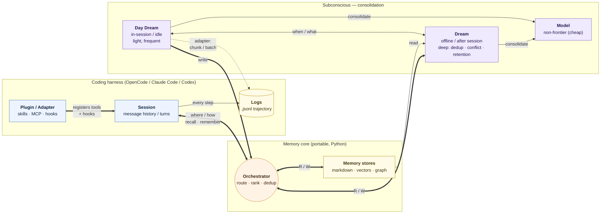

# System Diagram — Cookbook Memory

> Clean version of the team whiteboard sketch. The memory layer (orchestrator +
> stores + the offline "subconscious") sitting beside a harness session, with the
> plugin as the only thing the harness sees. Renders inline on GitHub.
>
> Vocabulary ties back to [`01-cross-harness-comparison.md`](01-cross-harness-comparison.md)
> and [`../opencode/05-integration-strategy.md`](../opencode/05-integration-strategy.md).

## Legend

| Element | What it is |
|---|---|
| **Plugin / Adapter** | The thin per-harness piece (skills · MCP · hooks) — the *only* thing the harness exposes. Registers `recall`/`remember` and observation hooks. |
| **Session** | The harness's live message history / turn loop. |
| **Logs (.jsonl)** | The trajectory log the eval harness grades from — one step per record. |
| **Orchestrator** | The memory core's read/write brain: routes a query to the right store, ranks by `recency × relevancy`, dedups, returns a tight context. Handles the **where / how** of memory. |
| **Memory stores** | The three indexed backends — markdown+YAML, SQLite+vectors, graph. |
| **Subconscious** | The offline consolidation band. |
| **Day Dream** | **In-session / idle** consolidation — light, frequent (e.g. between batches). |
| **Dream** | **Offline / after-session** consolidation — deep: cross-session dedup, conflict resolution, retention/pruning. |
| **Model (non-frontier)** | The cheap model that powers consolidation — *not* the frontier model running the agent. |

## How to read the flows

- **Plugin → Session:** the adapter wires memory tools + hooks into the harness loop.
- **Session ⇄ Orchestrator** (*where / how*): in-loop `recall` / `remember` — the
  model pulls memory and writes it back through the core.
- **Orchestrator ⇄ Memory stores** (*R/W*): the core reads/writes the backends.
- **Session → Logs:** every step is recorded as `.jsonl` for grading.
- **Day Dream → Orchestrator** (*write*) and **Dream ⇄ Orchestrator** (*R/W*):
  consolidation reads from and writes back into the memory path.
- **Memory stores → Dream** (*read*): deep dreaming reads the full store to
  consolidate.
- **Day Dream ⇄ Dream** (*when / what*): the light pass decides when/what to hand
  to the deep pass.
- **Day Dream / Dream → Model:** both call the cheap, non-frontier model to do the
  actual summarizing/extraction.
- **Day Dream ⇢ Logs** (*adapter: chunk/batch*): consolidation also emits batched
  records to the trajectory log.

> This is a conceptual proposal mirroring the whiteboard — not the frozen contract
> ([`../../architecture.md`](../../architecture.md)). The four modules map to the
> plan: persistence + router + retrieval = **Orchestrator + stores**; the dreaming
> component = **Subconscious (Day Dream + Dream)**.
